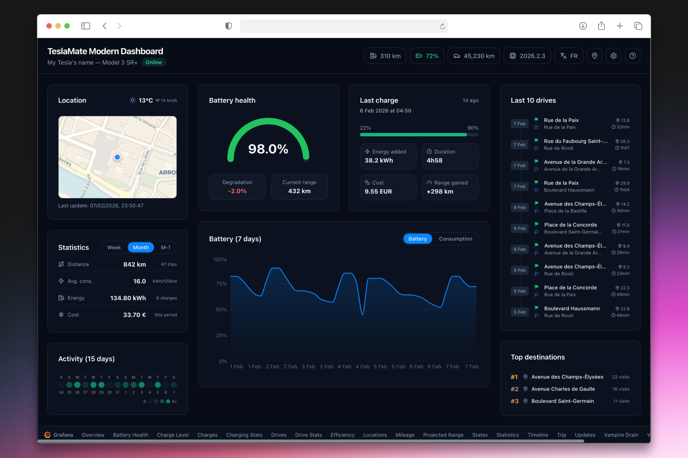

# TeslaMate Modern Dashboard

[](https://nodejs.org/) [](https://www.typescriptlang.org/) [](https://react.dev/) [](Dockerfile) [](LICENSE) [](https://teslamate-modern-dashboard.onrender.com/)

A modern, responsive web dashboard for [TeslaMate](https://github.com/teslamate-org/teslamate) — the self-hosted Tesla data logger.

Connects read-only to your existing TeslaMate PostgreSQL database. No modifications, no extra setup.

**[Live Demo (mock data)](https://teslamate-modern-dashboard.onrender.com/)**



## Demo Mode

Try the dashboard without a TeslaMate instance: **[Live Demo](https://teslamate-modern-dashboard.onrender.com/)**

Or run it locally:

```bash
npm run demo
```

This serves mock data on `http://localhost:5173` — no database required.

## Features

- **Live vehicle status** — battery level, firmware version, state (online/driving/charging/asleep)
- **Interactive map** — current position with integrated weather
- **Driving stats** — weekly, monthly, and last month summaries (distance, energy, cost)
- **Recent drives** — last 10 trips with consumption details
- **Battery health** — degradation gauge based on capacity data
- **Last charge** — energy added, duration, cost, range gained
- **Battery & consumption charts** — 7-day history with tabbed views
- **Drive heatmap** — 15-day activity overview (GitHub-style)
- **Top destinations** — most visited places
- **Bilingual** — French & English with one-click toggle
- **Dark mode** — always on, easy on the eyes

## Security Notice

The built-in HTTP Basic Auth (`AUTH_USERNAME` / `AUTH_PASSWORD`) is suitable for **local network** use. If you expose the dashboard to the internet, use a **reverse proxy with HTTPS** (e.g. [Traefik](https://docs.teslamate.org/docs/advanced_guides/traefik), nginx) to encrypt traffic. Without HTTPS, credentials are sent in Base64 (not encrypted) and can be intercepted.

## Docker (recommended)

The easiest way to deploy if you already run TeslaMate in Docker.

### Add to your existing TeslaMate stack

Clone the repository on your TeslaMate server:

```bash
git clone https://github.com/Zi0u/teslamate-modern-dashboard.git
```

Then add this service to your TeslaMate `docker-compose.yml`.

**If you use a `.env` file** (typical with [Traefik](https://docs.teslamate.org/docs/advanced_guides/traefik) setup):

```yaml
  teslamate-modern-dashboard:
    build:
      context: ./teslamate-modern-dashboard
    image: teslamate-modern-dashboard
    restart: always
    depends_on:
      - database
    ports:
      - "3001:3001"
    environment:
      - DATABASE_HOST=database
      - DATABASE_PORT=5432
      - DATABASE_NAME=${TM_DB_NAME}
      - DATABASE_USER=${TM_DB_USER}
      - DATABASE_PASSWORD=${TM_DB_PASS}
      - PORT=3001
      # Optional: protect the dashboard with a login/password
      # - AUTH_USERNAME=admin
      # - AUTH_PASSWORD=your_password_here
```

> The `TM_DB_*` variables are already defined in your TeslaMate `.env` file — no extra configuration needed.

**If you don't use a `.env` file** (credentials hardcoded in your `docker-compose.yml`):

Look for the `database` service in your existing `docker-compose.yml` to find your `POSTGRES_USER`, `POSTGRES_PASSWORD`, and `POSTGRES_DB` values, then use them directly:

```yaml
  teslamate-modern-dashboard:
    build:
      context: ./teslamate-modern-dashboard
    image: teslamate-modern-dashboard
    restart: always
    depends_on:
      - database
    ports:
      - "3001:3001"
    environment:
      - DATABASE_HOST=database
      - DATABASE_PORT=5432
      - DATABASE_NAME=teslamate       # same as POSTGRES_DB
      - DATABASE_USER=teslamate       # same as POSTGRES_USER
      - DATABASE_PASSWORD=secret      # same as POSTGRES_PASSWORD
      - PORT=3001
      # Optional: protect the dashboard with a login/password
      # - AUTH_USERNAME=admin
      # - AUTH_PASSWORD=your_password_here
```

Then run `docker compose up -d`. The dashboard will be available at `http://your-server:3001`.

### Standalone deployment

If you prefer to run the dashboard separately from TeslaMate:

```bash
git clone https://github.com/Zi0u/teslamate-modern-dashboard.git
cd teslamate-modern-dashboard

# Edit docker-compose.yml with your database credentials, then:
docker compose up -d
```

### Demo mode with Docker

```bash
docker build -t teslamate-modern-dashboard .
docker run --rm -p 3001:3001 -e DEMO_MODE=true teslamate-modern-dashboard
```

## Manual Installation

### Prerequisites

- **Node.js** 18+
- **TeslaMate** with a running PostgreSQL database

### Installation

```bash
git clone https://github.com/Zi0u/teslamate-modern-dashboard.git
cd teslamate-modern-dashboard
npm install

cp .env.example .env
# Edit .env with your TeslaMate database credentials
```

### Configuration

Edit the `.env` file at the project root:

```env
DATABASE_HOST=localhost
DATABASE_PORT=5432
DATABASE_NAME=teslamate
DATABASE_USER=teslamate
DATABASE_PASSWORD=your_password_here
PORT=3001
```

### Creating a read-only database user (optional)

The dashboard only reads data, so you can optionally use a dedicated read-only user instead of the main TeslaMate credentials:

```sql
CREATE USER teslamate_readonly WITH PASSWORD 'your_password_here';
GRANT CONNECT ON DATABASE teslamate TO teslamate_readonly;
GRANT USAGE ON SCHEMA public TO teslamate_readonly;
GRANT SELECT ON ALL TABLES IN SCHEMA public TO teslamate_readonly;
ALTER DEFAULT PRIVILEGES IN SCHEMA public GRANT SELECT ON TABLES TO teslamate_readonly;
```

### Usage

```bash
# Development (backend + frontend with hot reload)
npm run dev

# Demo mode (mock data, no database needed)
npm run demo

# Build for production
npm run build
```

The dashboard will be available at `http://localhost:5173` (dev) with the API on port `3001`.

## Tech Stack

- **Frontend**: React 18 + Vite + Tailwind CSS + Recharts + React Query
- **Backend**: Node.js + Express + TypeScript
- **Map**: Leaflet + CartoDB Voyager tiles (free, no API key)
- **Weather**: Open-Meteo API (free, no API key)

## License

[MIT](LICENSE)
