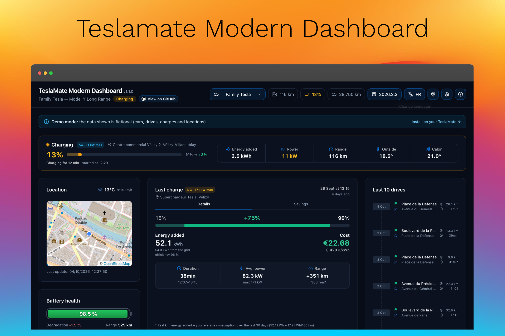

# TeslaMate Modern Dashboard

[](https://nodejs.org/) [](https://www.typescriptlang.org/) [](https://react.dev/) [](https://hub.docker.com/r/martingrn/teslamate-modern-dashboard) [](LICENSE) [](https://teslamate-modern-dashboard.onrender.com/)

A modern, responsive web dashboard for [TeslaMate](https://github.com/teslamate-org/teslamate) — the self-hosted Tesla data logger.

Connects read-only to your existing TeslaMate PostgreSQL database. No modifications, no extra setup.

**[Live Demo (mock data)](https://teslamate-modern-dashboard.onrender.com/)**



## Demo Mode

Try the dashboard without a TeslaMate instance: **[Live Demo](https://teslamate-modern-dashboard.onrender.com/)**

Or run it locally:

```bash
npm run demo
```

This serves mock data on `http://localhost:5173` — no database required.

## Features

### Live
- **Vehicle status** — battery level, range, odometer and state (online, driving, charging, asleep, offline). "Driving" and "charging" are detected from TeslaMate's open drives and charges.
- **Real-time map** — OpenStreetMap map that follows the car while driving (refreshed every 3 s), with zoom buttons and the local weather.
- **Live charging banner** — shown at the top while charging: level, energy added, power, range, outside and cabin temperature.
- **Firmware** — current version, linking to its release notes on [Not a Tesla App](https://www.notateslaapp.com/).

### Charging & costs
- **Last charge** — AC/DC and max power, location, level before/after, energy added (and drawn from the grid, efficiency), cost and price per kWh, duration, average power, range gained and "real" km.
- **Savings vs gasoline / diesel** — what the same distance would have cost with a 6.5 L/100 km gasoline car and a 5.5 L/100 km diesel car, with the savings and the cost per 100 km.
- **Fuel prices** — French national average fetched automatically from the official open data ([data.economie.gouv.fr](https://data.economie.gouv.fr/explore/dataset/prix-des-carburants-en-france-flux-instantane-v2/)) for charges in France, or your own prices for any country.
- **Currency** — €, US$, £, CHF or CA$ (display only: TeslaMate costs are already in your currency).

### Statistics
- **Week, month, previous month and year** — distance, average consumption, energy, cost, and savings vs gasoline / diesel. Charges without a cost set in TeslaMate are flagged instead of being silently ignored.
- **Battery health** — capacity-based health and degradation (same method as TeslaMate's Grafana dashboard).
- **Battery & consumption charts** — 7-day battery level, and daily consumption with the distance-weighted average.

### Drives
- **30-day activity** — one cell per day colored by distance, weekends highlighted, charging days marked. Click a day to see its **day details** (distance, drives, charges, energy, cost).
- **Recent drives** — last 10 trips with distance and duration.
- **Top destinations** — most visited places.

### Everything else
- **Multiple cars** — car selector; cars whose data collection is disabled in TeslaMate (e.g. a sold car) are hidden, their history stays intact.
- **Local time** — days, weeks and months are cut at midnight in your browser's time zone.
- **Bilingual** — French & English with one-click toggle.
- **About dialog** — explains the features and how every value is calculated.
- **Demo mode** — mock data, no database needed.
- **Responsive & dark** — desktop, tablet and mobile.

## Security Notice

The built-in HTTP Basic Auth (`AUTH_USERNAME` / `AUTH_PASSWORD`) is suitable for **local network** use. If you expose the dashboard to the internet, use a **reverse proxy with HTTPS** (e.g. [Traefik](https://docs.teslamate.org/docs/advanced_guides/traefik), nginx) to encrypt traffic. Without HTTPS, credentials are sent in Base64 (not encrypted) and can be intercepted.

## Docker (recommended)

The easiest way to deploy. The image is published on Docker Hub — no build required.

```
martingrn/teslamate-modern-dashboard:latest
```

### Add to your existing TeslaMate stack

Add this service directly to your TeslaMate `docker-compose.yml` — no cloning needed.

**If you use a `.env` file** (typical with [Traefik](https://docs.teslamate.org/docs/advanced_guides/traefik) setup):

```yaml
  teslamate-modern-dashboard:
    image: martingrn/teslamate-modern-dashboard:latest
    restart: always
    depends_on:
      - database
    ports:
      - "3001:3001"
    environment:
      - DATABASE_HOST=database
      - DATABASE_PORT=5432
      - DATABASE_NAME=${TM_DB_NAME}
      - DATABASE_USER=${TM_DB_USER}
      - DATABASE_PASSWORD=${TM_DB_PASS}
      - PORT=3001
      # Optional: protect the dashboard with a login/password
      # - AUTH_USERNAME=admin
      # - AUTH_PASSWORD=your_password_here
```

> The `TM_DB_*` variables are already defined in your TeslaMate `.env` file — no extra configuration needed.

**If you don't use a `.env` file** (credentials hardcoded in your `docker-compose.yml`):

Look for the `database` service in your existing `docker-compose.yml` to find your `POSTGRES_USER`, `POSTGRES_PASSWORD`, and `POSTGRES_DB` values, then use them directly:

```yaml
  teslamate-modern-dashboard:
    image: martingrn/teslamate-modern-dashboard:latest
    restart: always
    depends_on:
      - database
    ports:
      - "3001:3001"
    environment:
      - DATABASE_HOST=database
      - DATABASE_PORT=5432
      - DATABASE_NAME=teslamate       # same as POSTGRES_DB
      - DATABASE_USER=teslamate       # same as POSTGRES_USER
      - DATABASE_PASSWORD=secret      # same as POSTGRES_PASSWORD
      - PORT=3001
      # Optional: protect the dashboard with a login/password
      # - AUTH_USERNAME=admin
      # - AUTH_PASSWORD=your_password_here
```

Then run `docker compose up -d`. The dashboard will be available at `http://your-server:3001`.

### Standalone deployment

If you prefer to run the dashboard separately from TeslaMate, create a `docker-compose.yml`:

```yaml
services:
  teslamate-modern-dashboard:
    image: martingrn/teslamate-modern-dashboard:latest
    restart: always
    ports:
      - "3001:3001"
    environment:
      - DATABASE_HOST=your-db-host
      - DATABASE_PORT=5432
      - DATABASE_NAME=teslamate
      - DATABASE_USER=teslamate
      - DATABASE_PASSWORD=your_password_here
      - PORT=3001
```

Then run `docker compose up -d`.

### Demo mode with Docker

```bash
docker run --rm -p 3001:3001 -e DEMO_MODE=true martingrn/teslamate-modern-dashboard:latest
```

## Manual Installation

### Prerequisites

- **Node.js** 18+
- **TeslaMate** with a running PostgreSQL database

### Installation

```bash
git clone https://github.com/Zi0u/teslamate-modern-dashboard.git
cd teslamate-modern-dashboard
npm install

cp .env.example .env
# Edit .env with your TeslaMate database credentials
```

### Configuration

Edit the `.env` file at the project root:

```env
DATABASE_HOST=localhost
DATABASE_PORT=5432
DATABASE_NAME=teslamate
DATABASE_USER=teslamate
DATABASE_PASSWORD=your_password_here
PORT=3001
```

### Creating a read-only database user (optional)

The dashboard only reads data, so you can optionally use a dedicated read-only user instead of the main TeslaMate credentials:

```sql
CREATE USER teslamate_readonly WITH PASSWORD 'your_password_here';
GRANT CONNECT ON DATABASE teslamate TO teslamate_readonly;
GRANT USAGE ON SCHEMA public TO teslamate_readonly;
GRANT SELECT ON ALL TABLES IN SCHEMA public TO teslamate_readonly;
ALTER DEFAULT PRIVILEGES IN SCHEMA public GRANT SELECT ON TABLES TO teslamate_readonly;
```

### Usage

```bash
# Development (backend + frontend with hot reload)
npm run dev

# Demo mode (mock data, no database needed)
npm run demo

# Build for production
npm run build
```

The dashboard will be available at `http://localhost:5173` (dev) with the API on port `3001`.

## Your data

- The dashboard is **read-only**: it never writes to your TeslaMate database.
- External services used, without any personal data: map tiles ([OpenStreetMap](https://www.openstreetmap.org/)), weather ([Open-Meteo](https://open-meteo.com/)) and French average fuel prices ([data.economie.gouv.fr](https://data.economie.gouv.fr/)).
- Your fuel prices and currency (set with the **Prices** button) are stored only in your browser.

## Hiding a sold or inactive car

In TeslaMate, open **Settings**, select the car and disable **Enabled** (data collection). The car is then hidden from the dashboard; its history stays in the database and Grafana. Enable it again to bring it back.

## Tech Stack

- **Frontend**: React 18 + Vite + Tailwind CSS + Recharts + React Query
- **Backend**: Node.js + Express + TypeScript
- **Map**: Leaflet + OpenStreetMap tiles (free, no API key)
- **Weather**: Open-Meteo API (free, no API key)

## License

[MIT](LICENSE)
